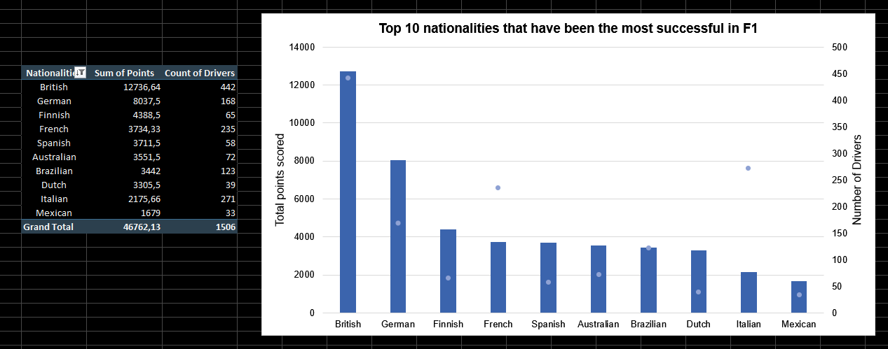
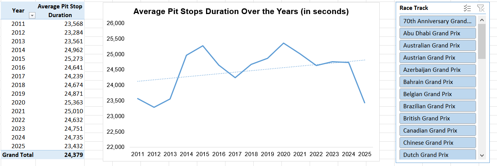
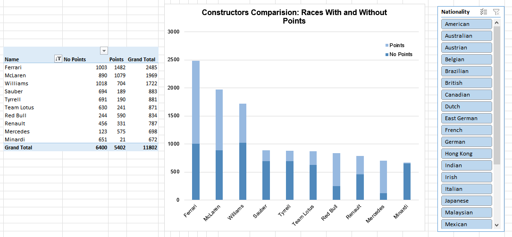
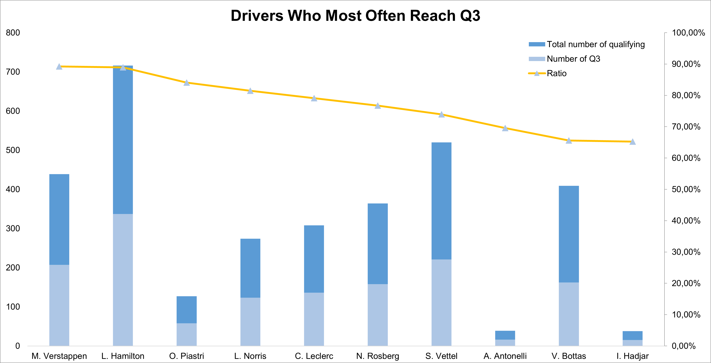
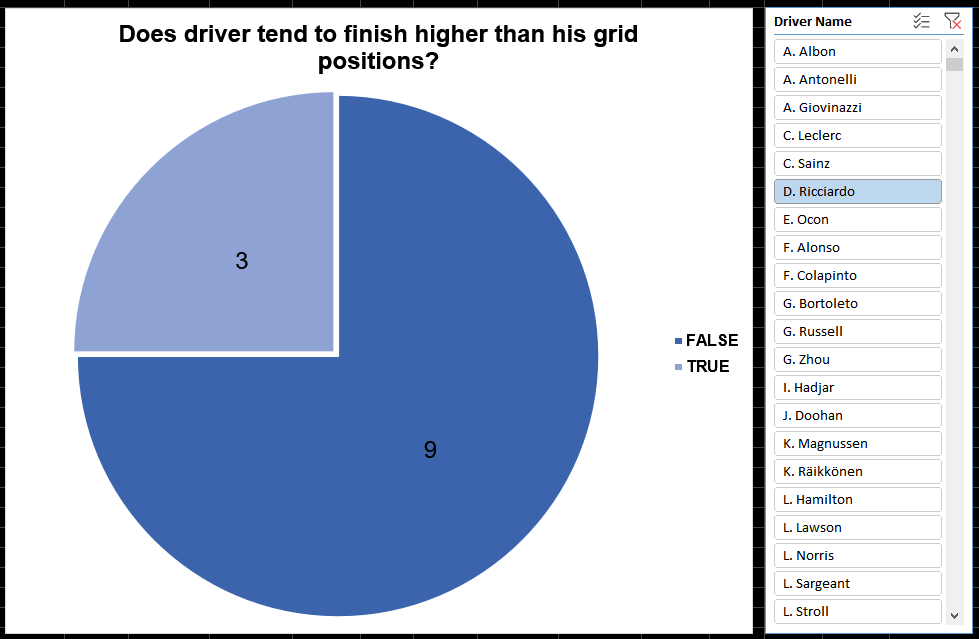

# 🏁 Excel F1 Dataset Analysis

## 📚 Table of Contents
- **Project Overview**
- **Data Overview**
- **Structure Explanation**
- **Data Analysis**
- **Skills Used**
- **Data Source**
- **Author**

## 🔎 Project Overview

The goal of this project is to analyze F1 data using Excel. I used two powerful Excel tools to do this: Power Query and Power Pivot. 

## 📂 Data Overview

There are 14 different data files, including circuits, constructors, drivers, races, etc.

**Data Cleanup:** Before the analysis, I cleaned the data in Power Query: necessary data types changes were made, some values were replaced, some rows containing errors and unnecessary columns were removed.

## 🧱 Structure Explanation

| Folder / File | Description |
|----------------|-------------|
| **data/** | Contains original data files |
| **images/** | Includes Excel charts and screenshots of skills used in the project |
| **excel_analysis** | Main project folder (includes 2 Excel files) |
| **README.md** | Project overview |

## 📊 Data Analysis

### Nationalities that have been the most successful in F1

### Average Pit Stops Duration Over the Years 

### Constructors Comparision: Races With and Without Points

### Drivers Who Most Often Reach Q3

### Does driver tend to finish higher than his grid positions? (comparision for only one driver selected in the slicer)

## 💪 Skills Used

1. **Power Query**
   - 1.1 Merging Queries
   - 1.2 Adding Conditional Columns
   - 1.3 Removing and Duplicating Columns
   - 1.4 Group By
   - 1.5 Changing Data Types
   - 1.6 Data transformations within rows
2. **Power Pivot**
   - 2.1 Data Modeling (Relationships)
   - 2.2 Measures
   - 2.3 DAX Language
3. **Other Skills:**
   - 3.1 PivotTables
   - 3.2 PivotCharts
   - 3.3 Slicers

## 🔗 Data Source
[Kaggle Formula 1 World Championship (1950 - 2024)](https://www.kaggle.com/datasets/rohanrao/formula-1-world-championship-1950-2020) 

## ✒️ Author

- **Author:** Mateusz Bochenek
- **Mail:** matbochenek42@gmail.com
- **GitHub link:** https://github.com/matbochenek42
- **LeetCode link:** https://leetcode.com/u/SmO7BWmsiz/
