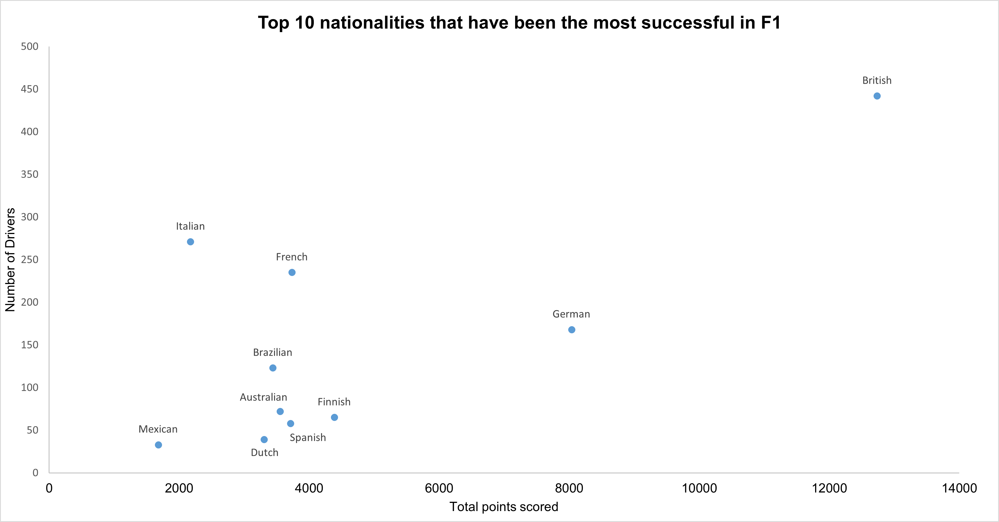
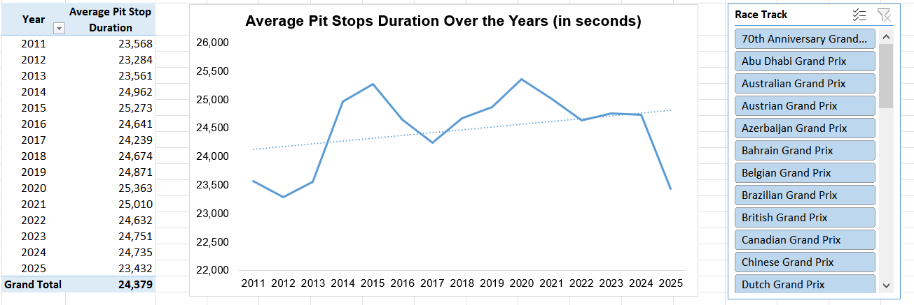
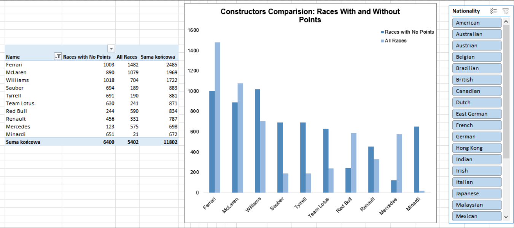
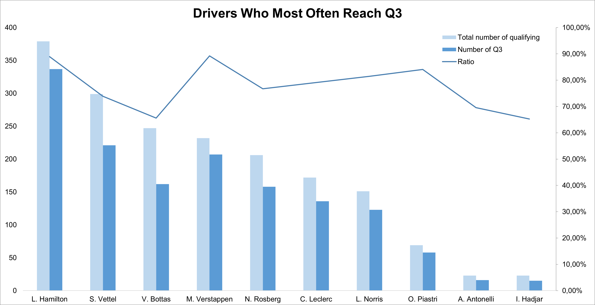
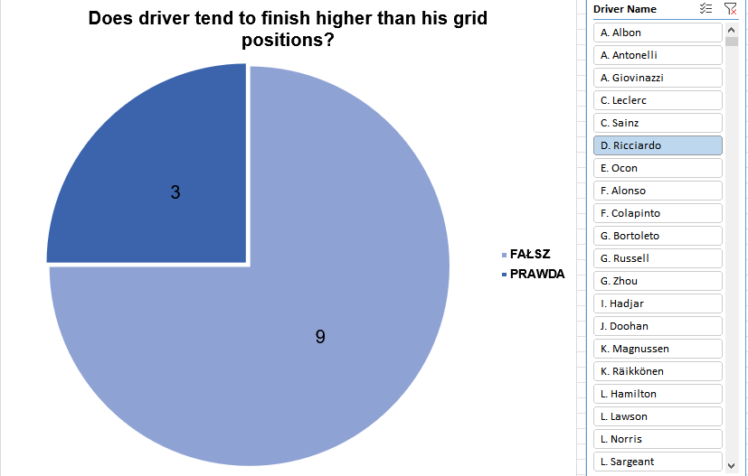

# 🏁 Excel F1 Dataset Analysis

## 📚 Table of Contents
- **Project Overview**
- **Data Overview**
- **Structure Explanation**
- **Data Analysis**
- **Skills Used**
- **Data Source**
- **Author**

## 🔎 Project Overview

The goal of this project is to analyze F1 data using Excel. I used two powerful Excel tools to do this: Power Query and Power Pivot. 

## 📂 Data Overview

There are 14 different data files, including circuits, constructors, drivers, races, etc.

**Data Cleanup:** Before the analysis, I cleaned the data in Power Query: necessary data types changes were made, some values were replaced, some rows containing errors and unnecessary columns were removed.

## 🧱 Structure Explanation

| Folder / File | Description |
|----------------|-------------|
| **data/** | Contains original data files |
| **images/** | Includes Excel charts and screenshots of skills used in the project |
| **excel_analysis** | Main project folder (includes 2 Excel files) |
| **README.md** | Project overview |

## 📊 Data Analysis

### Nationalities that have been the most successful in F1

**Visualization:**

**Insights:**

F1 is dominated by British drivers. They have scored the most points (more than 12 000) and the highest total number of drivers (around 450). Another nationality that stands out is German, with around 8000 points scored by fewer than 200 drivers. Other countries in the top 10 are mainly European nationalities, with the exception of Australian, Brazilian and Mexican.   

### Average Pit Stops Duration Over the Years 

**Visualization:**

**Insights:**

Pit stops duration in F1 are extremely rapid nowadays, although the fastest ones occurred at the beginning of 2010s and then again in 2025 (around 23 seconds per pit stop). As far as I can tell, the biggest impact comes from team coordination, race tracks (different pit lanes length or speed limit rules) and random incidents. There haven't been any significant changes in F1 rules that influanced pit stops duration itself in the past couple of years. 

The chart can be filtered by race track.

**Note:** Pit stop time includes pit lane entry, service, and exit. 

### Constructors Comparision: Races With and Without Points

**Visualization:**

**Insights:**

Overall, the OG constructors have the most races in F1: Ferrari, McLaren and Williams. Unfortunately, Williams has finished over 50% races without scoring any points, due to the decline of the team in recent decades. It is worth noting that drivers from two modern teams - Red Bull and Mercedes - tend to finish most races with some points.

### Drivers Who Most Often Reach Q3

**Visualization:**

**Insights:**

Drivers who reach Q3 most often are Verstappen and Hamilton, with a ratio of almost 90%. Two rookies, Antonelli and Hadjar, deserve praise for achieving a remarkably high ratio despite their lack of experience in F1. 

### Does driver tend to finish higher than his grid positions? (comparision for only one driver selected in the slicer)

**Visualization:**

**Insights:**

For instance, D. Ricciardo finished higher than his grid position only three times.

## 💪 Skills Used

1. **Power Query**
   - Merging Queries
   - Adding Conditional Columns
   - Removing and Duplicating Columns
   - Group By
   - Changing Data Types
   - Data transformations within rows
2. **Power Pivot**
   - Data Modeling (Relationships)
   - Measures
   - DAX Language
3. **Other Skills:**
   - PivotTables
   - PivotCharts
   - Slicers

## 🔗 Data Source
[Kaggle Formula 1 World Championship (1950 - 2024)](https://www.kaggle.com/datasets/rohanrao/formula-1-world-championship-1950-2020) 

## ✒️ Author

- **Author:** Mateusz Bochenek
- **Mail:** matbochenek42@gmail.com
- **GitHub link:** https://github.com/matbochenek42
- **LeetCode link:** https://leetcode.com/u/SmO7BWmsiz/
